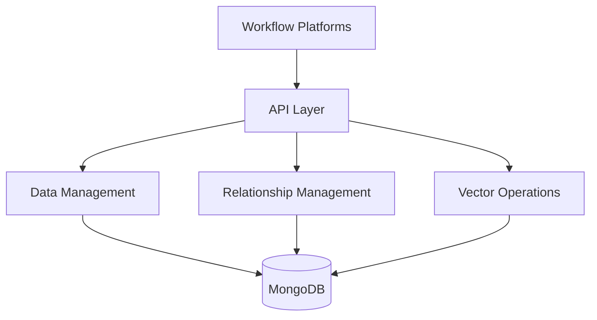
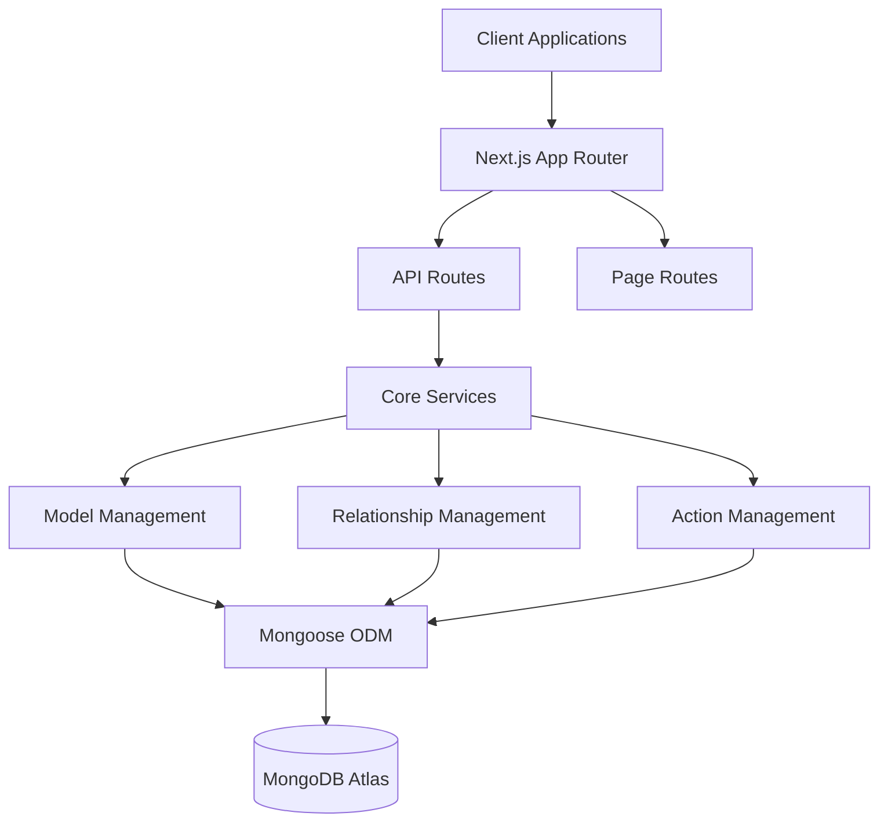

# Infinity Technical Architecture

## System Overview
- central data service designed for workflow automation platforms (n8n, Make, Zapier)
- serves as single source of truth for data management and relationship tracking
- provides semantic operations through vector embeddings
- enables workflow coordination across platforms

## Data Model Architecture
- supports core data types: string, number, boolean, date, array, object, vector
- all models include base fields: id, owner_id, created_at, updated_at
- vector field uses OpenAI's ada-002 model (1536 dimensions)
- handles one-to-one and one-to-many relationships with cascade behavior



## Core Components

### Data Model Management
- schema creation and modification through API
- field type validation and constraints
- schema creation and modification is performed via API endpoints with rigorous data validation using Zod. This ensures that all field constraints (e.g., required fields, uniqueness, enums) defined in docs/03-schema.md are enforced both at the API layer and within Mongoose ODM.

### Relationship Management
- supports one-to-one relationships (User to Profile)
- handles one-to-many relationships (Company to Employees)
- manages cascade operations on delete/update
- automatic foreign key consistency
- supports one-to-one and one-to-many relationships as defined in docs/03-schema.md. Advanced relationship types, such as many-to-many associations, computed fields, or polymorphic relationships, are explicitly out-of-scope for the MVP (see docs/02-out-of-scope.md). Relationship configurations include cascade, setNull, or restrict behaviors, which are automatically enforced.

### Database Operations
- The system stores custom model data in MongoDB. Each custom model document is stored in a collection with its unique model id (as defined in the model schema) as the primary identifier.
- Standard CRUD operations on data models are exposed via API endpoints and utilize the unique model id to ensure global uniqueness across all users.
- Pre-configured action templates streamline common operations.
- Built-in operation status tracking monitors execution and success of all database operations.
- Automatic vector generation is performed for models with embedding enabled.

### Embedding Management
- automatic vector field management (1536 dimensions)
- vector generation from configured source fields
- updates vectors when source content changes
- enables similarity search operations

### System Models
The system also manages internally-defined system models as specified in docs/03-schema.md. These include:
- ApiKey: Contains fields such as id, owner_id, key, name, is_active, description, created_at, and updated_at; used for authenticating workflow automation platforms and managing access.
- Log: Stores system log entries with fields including id, timestamp, level, category, message, and details; used for operational monitoring and error tracking.
These system models are maintained internally and are not exposed via standard CRUD endpoints to end users.

## API Structure
- model management endpoints for schema operations
- data operation endpoints for CRUD actions
- relationship query endpoints
- vector similarity search endpoints
- authentication endpoints for API keys and tokens

## Security
- API key authentication for workflow platforms
- JWT tokens for admin interface
- basic input validation and sanitization
- operation logging and tracking

## Infrastructure
- MongoDB for data and vector storage
- Next.js for API and admin interface
- TypeScript for type safety
- OpenAI ada-002 for embeddings



## Technology Choices
- frontend stack combines Next.js, React, TailwindCSS, and TypeScript for type-safe development
- api layer built on Next.js API routes with Zod for runtime type validation
- authentication handled through JWT (browser clients) and API keys (automation platforms)
- database operations managed through Mongoose ODM for type-safe queries and schema management
- vector operations integrated directly into document operations using MongoDB's vector search

## Core Services
- model management handles schema validation, field types, and relationship definitions
- relationship service manages one-to-one and one-to-many relationships with cascade operations
- action service combines CRUD operations with automatic vector generation for configured fields

## Data Structure
- MongoDB collections store custom model records based on the schema defined in 03-schema.md. Each record uses the model's unique id as the primary identifier, ensuring uniqueness across all users.
- Documents include base fields (id, owner_id, created_at, updated_at), a human-readable model name, and a dynamic "fields" object for custom data.
- When embedding is enabled, a 1536-dimensional vector field is automatically generated and maintained within the document.
- Example document structure:
```typescript
{
  id: string                    // Unique model id (e.g., "model_def_123")
  owner_id: string              // References user
  name: string                  // Model name (for display purposes)
  fields: { [key: string]: any }     // Dynamic model-specific fields as per schema
  vector?: number[]             // Optional embedding vector (1536 dimensions)
  created_at: Date            
  updated_at: Date            
}
```

## API Design
- restful endpoints exposed for all core operations (CRUD + vector search)
- routes follow Next.js App Router conventions:
  ```
  /api/models    - model definition management
  /api/actions   - document operations + vector search
  /api/auth      - authentication endpoints
  ```
- all endpoints validate input using Zod schemas
- vector operations automatically handled during document creation/updates
- Note: The API is designed to strictly adhere to the MVP scope as defined in docs/02-out-of-scope.md. Advanced features such as many-to-many relationships, computed fields, automatic schema migrations, and extensive analytics are deliberately excluded.

## Project Organization

The Infinity project is organized into several key directories to ensure a clear separation of concerns and maintain scalability. Below is an overview of the project structure:

- **src/**
  - **app/**: Next.js App Router's route definitions, including both API endpoints and page routes.
  - **components/**: UI components used throughout the admin interface and client-side application.
  - **lib/**: Shared utilities and helper functions, such as database connections, middleware, and configuration utilities.
  - **services/**: Core business logic, including model management, relationship handling, action management, and vector operations.

- **tests/**: Automated test suites for API endpoints, business logic, and UI components to ensure robust functionality and prevent regressions.

- **docs/**: Documentation files outlining system architecture, feature specifications, design decisions, and usage guidelines.

- **config/**: Environment configurations, deployment scripts, Dockerfiles, and CI/CD pipeline configurations.

This modular structure allows developers to work on different aspects of the application concurrently without interference. API routes leverage Next.js's file-based routing for clarity, while centralized services and utilities promote code reuse and maintainability. Additional infrastructure components can be added into the config directory as the project evolves.

## Security & Monitoring
- authentication through JWT tokens and API keys
- basic rate limiting on API endpoints
- CORS configuration for API access
- request logging and error tracking
- basic API usage metrics collection
``` 