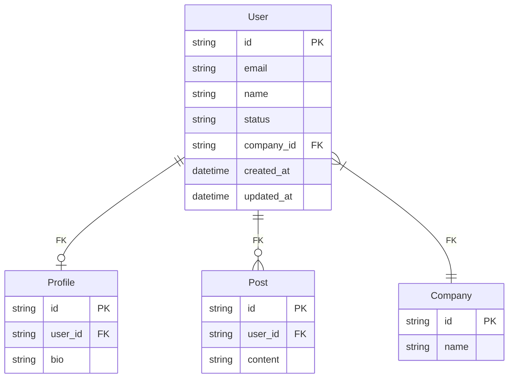
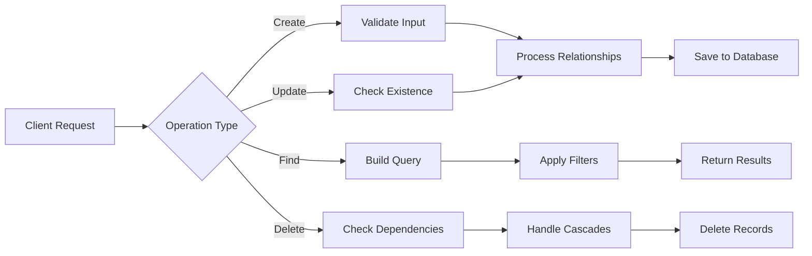
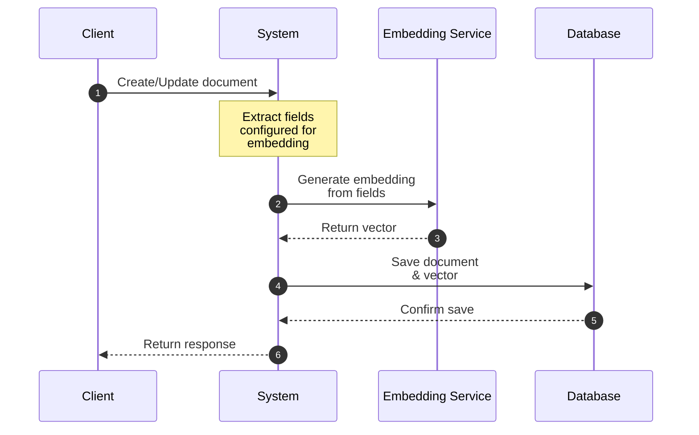

# Infinity Data Schema Definition

## Core Data Types

The following are the supported data types for model properties:

- `string`: Text values
- `number`: Numeric values (integers or floating point)
- `boolean`: True/false values
- `date`: DateTime values
- `array`: List of values
- `object`: Nested JSON objects
- `vector`: 1536-dimensional vector (automatically managed for embedding-enabled models)

## Base Models

All models automatically include the following fields:

```typescript
{
  id: string;           // Unique identifier
  owner_id: string;     // References System User
  created_at: date;     // Creation timestamp
  updated_at: date;     // Last update timestamp
}
```

## System User Model
```typescript
{
  id: string;           // Required, UUID v4
  email: string;        // Required, Unique
  name: string;         // Required
  status: string;       // enum: ['active', 'inactive']
  created_at: date;     // Required
  updated_at: date;     // Required
}
```

## Model Definition Schema

Models are defined using a declarative schema that specifies fields, relationships, and behaviors:

```typescript
{
  id: string;           // Model definition ID
  owner_id: string;     // References System User
  name: string;         // Model name
  description?: string; // Optional description
  
  "fields": {
    [fieldName: string]: {
      "id": string;         // Field identifier
      "type": string;       // One of the core data types
      "required"?: boolean; // Whether the field is required
      "unique"?: boolean;   // Whether the field must be unique
      "default"?: any;      // Default value if not provided
      "enum"?: any[];      // For fields with enumerated values
      "description"?: string; // Field description
      "foreign_key"?: {    // If field is a foreign key
        "references": {
          "model_id": string;  // Referenced model definition ID
          "field_id": string;  // Referenced field ID (usually the 'id' field)
        }
      }
    }
  },
  "relationships": {
    [relationName: string]: {
      "id": string;        // Relationship identifier
      "type": "hasOne" | "hasMany" | "belongsTo";
      "target_model_id": string;  // References another model definition ID
      "foreign_key": {
        "field_id": string;      // References field ID in this or target model
      }
      "onDelete"?: "cascade" | "setNull" | "restrict";
      "onUpdate"?: "cascade" | "setNull" | "restrict";
    }
  },
  "indexes"?: {
    [indexName: string]: {
      "fields": string[];    // References field IDs
      "unique"?: boolean;
    }
  }
}
```

### Example Model Definition

```typescript
{
  "id": "model_def_123",
  "owner_id": "user_123",
  "name": "User",
  "description": "Custom user model for application",
  
  "fields": {
    "email": {
      "id": "field_email_123",
      "type": "string",
      "required": true,
      "unique": true
    },
    "name": {
      "id": "field_name_123",
      "type": "string",
      "required": true
    },
    "company_id": {
      "id": "field_company_123",
      "type": "string",
      "foreign_key": {
        "references": {
          "model_id": "model_def_company_123",
          "field_id": "field_id_123"
        }
      }
    }
  },
  "relationships": {
    "profile": {
      "id": "rel_profile_123",
      "type": "hasOne",
      "target_model_id": "model_def_profile_123",
      "foreign_key": {
        "field_id": "field_user_id_123"
      },
      "onDelete": "cascade"
    }
  }
}
```

## System Models

### ApiKey
```typescript
{
  id: string;          // Required, UUID v4
  owner_id: string;    // Required, References System User
  key: string;         // Required, Unique, encrypted
  name: string;        // Required, human readable identifier
  is_active: boolean;  // Required
  description?: string; // Optional
  created_at: date;    // Required
  updated_at: date;    // Required
}
```

### Log
```typescript
{
  id: string;           // Required, UUID v4
  timestamp: date;      // Required
  level: string;        // Required, enum: ['info', 'warn', 'error']
  category: string;     // Required, enum: ['api', 'system']
  message: string;      // Required, human readable description
  details: {            // Simplified details
    method?: string;    // For API logs
    endpoint?: string;  // For API logs
    status_code?: number; // For API logs
    response_time?: number; // For API logs (in milliseconds)
    error?: string;     // For error logs
  }
}
```

## Operations

Operations are standard CRUD actions that can be performed on models. The system automatically handles relationships based on the model definition.

### Basic Operations
- **create**: Create new records
- **find**: Query records with optional relationship inclusion
- **update**: Modify records
- **delete**: Remove records (handles cascading based on relationship rules)

### Operation Examples

```typescript
// Create with relationship
{
  "operation": "create",
  "model": "User",
  "data": {
    "email": "user@example.com",
    "name": "John Doe",
    "profile": {
      "bio": "Software developer"
    }
  }
}

// Find with included relationships
{
  "operation": "find",
  "model": "Company",
  "where": {
    "domain": "example.com"
  },
  "include": ["employees"]  // Include related User records
}

// Delete with cascade
{
  "operation": "delete",
  "model": "User",
  "where": {
    "id": "user123"
  }
  // System automatically handles cascade deletes based on relationship definitions
}
```

## Embedding Configuration

Models can be configured to support vector embeddings:

```typescript
{
  "models": {
    "Document": {
      "fields": {
        "title": { "type": "string" },
        "content": { "type": "string" }
      },
      "embedding": {
        "enabled": true,
        "source_fields": ["title", "content"]
      }
    }
  }
}
```

## Notes

1. All string fields have a maximum length of 255 characters unless otherwise specified
2. Timestamps are stored in UTC
3. Vector embeddings are automatically updated when source content changes
4. All IDs are UUID v4 format
5. System models (ApiKey, Log) are managed by the system and not exposed through the regular data model APIs
6. Relationships are defined at the model definition layer and automatically managed by the system

## Visual Representations

### Data Model Relationships


### System Operation Flow


### Embedding Process
When a document is created or updated and has embedding enabled:

1. Client sends document data
2. System extracts the source fields configured for embedding
3. Embedding service generates the vector
4. System saves both document and vector to database
5. Response returned to client

